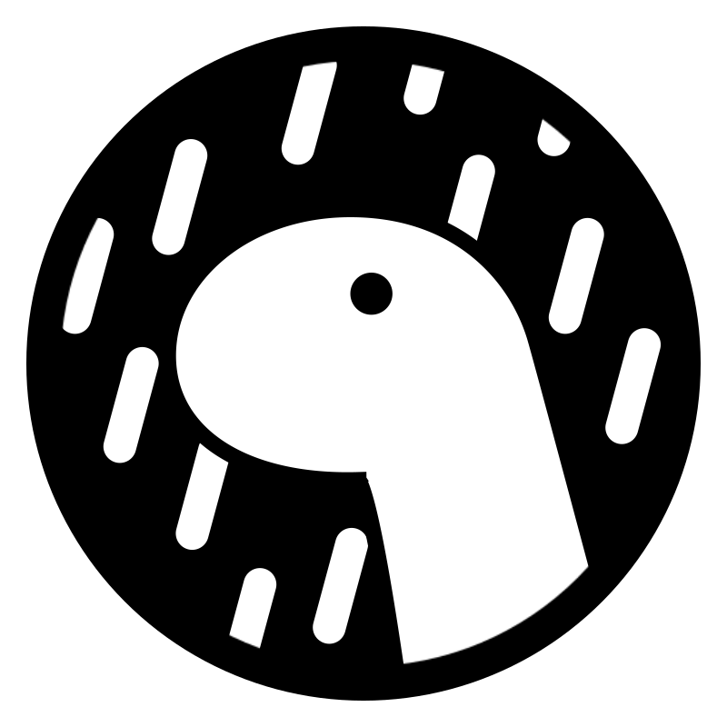
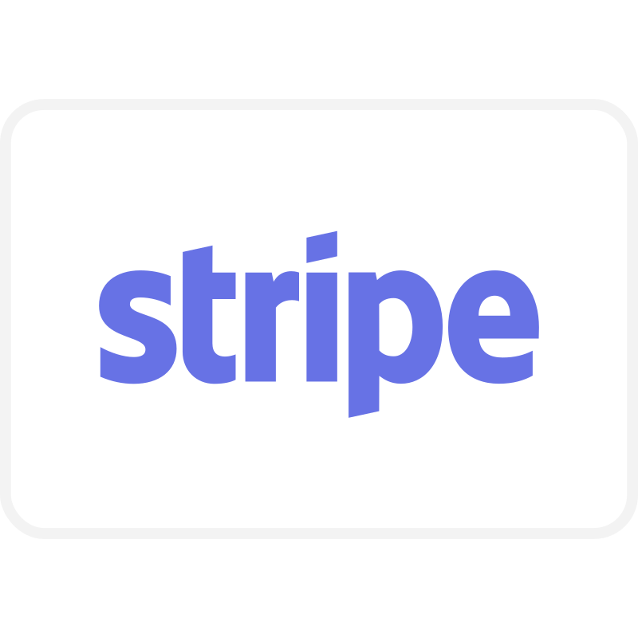

Hi My name is Shayan
==============================================================================================================================

MERN Stack Developer
-----------------------

Enthusiastic and Skilled Developer with a strong foundation in Web & Mobile Development, having 1+ years of experience. Worked for innovative startups, large products, and agencies. Familiar with both remote, and in-office roles. Always seeking to take ownership of the project and deliver faster than expected. Comfortable for web, mobile, and API development.

* 🌍  I'm based in Karachi, Pakistan
* 🖥️  See my [Portfolio](https://shayan-workspace.vercel.app)
* ⚡  See my [LikedIn Profile](https://www.linkedin.com/in/shayan-workspace)
* ✉️  You can contact me at [shayan.workspace@gmail.com](mailto:shayan.workspace@gmail.com)
* 🤝  I'm open to collaborate on interesting projects

## 🛠️ Technologies & Tools

